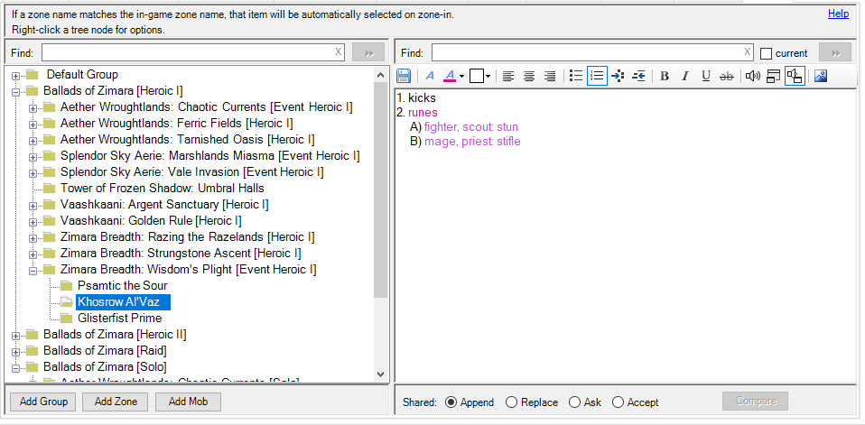

# ACT Notes Plugin
This Advanced Combat Tracker (ACT) plugin provides a means of organizing notes about zones and mobs.

The left hand panel provides a list of zones with subheadings for mobs within that zone.

The right hand panel provides a basic editor for any notes about the selected zone or mob.

All entries are user-generated, but can be shared using ACT's XML sharing mechanism.

An example is shown below.

## Update Notes
_Version 1.2_
* When [sharing notes](#sharing-notes), pressing the __[Macro]__ button now presents the list of macro files in the listbox.
* When [sharing notes](#sharing-notes), the plugin now searches for any running EQII game(s) and activates the selected game window when the __[Macro]__ or __[Copy]__ button is pressed, so the next keypress goes to the game instead of the plugin.
* When [sharing notes](#sharing-notes), if a running EQII game is found, the initial view is the list of `do_file_commands` to share the note via macro(s).

## Adding Zones and Mobs
The **[Add Zone]** button creates a new entry in the zone list. 
The **[Add Mob]** button creates a new mob in the currently selected zone.

Zone and mob names can be arbitrary text, but if they match in-game zone and mob names, the plugin will track when you enter the zone or kill the mob.

The easiest way to add a zone or mob to the list is to use the encounter list on ACT's main tab.
The default text when adding a new zone or mob is the selected zone name or mob name in the main encounter list.

In the example below, the desired zone is selected, then the **[Add Zone]** button is pressed, then the `Enter` key
is pressed to accept the entry. Mobs are similarly added by selecting the mob, pressing the **[Add Mob]** button, 
then the `Enter` key. Mob names can be picked up from either the zone encounter list or a particular mob encounter list. Both methods are shown in the example below.

When a fight involves more than one name, if all the names are entered for the mob name (separated by commas), the plugin will try to match each name when monitoring kills. In the example below, two-mob fights are set up with minimal typing by using the following steps:
  1. On the ACT Main tab, select the first mob
   2. On the plugin tab, press **[Add Mob]** and `<Enter>`
   3. On the Main tab, select the second mob in the first mob's encounter list
   4. On the plugin tab, press **[Add Mob]**, then answer "Yes" to the append question

## Adding Notes
Simply type in the editor panel after a zone or mob is selected to create a note for that zone or mob.

The editor allows the choice of font, colors, bullets, URLs, images, etc.

The editor can save many image types using either `Ctrl-V` to insert from the clipboard, or the `Insert image from file` toolbar button (which also uses the clipboard).
**Note:** The plugin saves the images as text bitmaps, which is not very efficient for loading, storing, or sharing.

## Monitoring
Whenever a player enters a zone, the plugin searches its zone list for a matching zone name.
If a match is found, that zone is selected. 

If the zone itself has a note, that note is displayed.

If there is no note for the zone, but there are mobs, the first mob in the zone's list is selected, whether it has a note or not.

When an encounter ends, the plugin looks for the killed enemy's name in its mob list for the zone. 
If the name is found, the next mob in the zone list is automatically selected. 
The intent is to display the note for the mob you are about to kill. 
But this process is not 100% reliable. 
It's just an aid to save you maybe one click to select the notes for your next mob.

If the mob order in the zone list is not in the order you usually kill them, 
the list can be re-ordered by draggging and dropping the mobs into the desired order.

## Sharing Notes
Right-click the zone name in the tree to share a zone note. Right-click a mob name in the tree to share a mob note.

The notes are stored as Rich Text Format (RTF). This format provides the capability to change the font, color, bullets, etc, but does add overhead.

The `Copy to XML` menu allows sharing notes in ACT with other users of the plugin. The `Export to RTF` menu allows exporting the notes out of ACT to a WordPad file.

### Share Channel
For the first XML share in a zone, the plugin guesses whether you are likely in a group or raid from the selected zone name
and chooses the supposed prefix, `/g` or `/r`. This can be changed by selecting the appropriate button.
To paste in a different channel, use the `custom` choice. For example, if you wanted to paste to the guild, you would select the `custom` button and enter `/gu` in the textbox. The selected prefix is saved for each zone.

### Note Segmenting
EQII can only paste around 250 characters at a time in a chat window, and allows about 1000 characters per line and 16 lines in a macro. Even a small shared note requires multiple sections.

The plugin automatically breaks a note into appropriate sharable sizes.

There are two methods for sharing a note. The first method is similar to how a trigger is shared in ACT. The second method uses EQII macros.

The plugin searches for an EQII game window when it opens the share dialog. If a game window is found, the dialog shows the macro command list by default. The clipboard copy list can be show by pressing the __[Copy]__ button.

 Notes with even a small image in them will result in a lot of sections, making the macro the only reasonable option. Version 1.1 of the plugin adds an option to compress notes with images. This typically reduces the number of sections. But the recipient of the note must be running plugin version 1.1 or newer to decode the compression. **Version 1.0 of the plugin will generate an error every time it tries to view the note if it receives a compressed note.**

Once all recipients have updated to plugin version 1.1 or newer, the **Compress Images** checkbox can remain checked. The checkbox has no effect if the note does not contain an image since there is not a big difference between the size of a compressed and uncompressed note that does not contain any image.

Below is an example that results in one macro when compressed. This particular note is 200 copy sections or three macros when not compressed.

#### Method 1: Paste Share
To paste into a chat window, the sender of the note needs to copy each section from the plugin using the plugin's **[Copy]** button and then use `Ctrl-V` to paste it in the chat window. In this example, three sections are required. The `/g` selection prefixes the section with the groupsay command. 

When the __Game Window:__ is not blank, pressing the __[Macro]__ or __[Copy]__ button activates the selected game window. Once the game window is activated, the chat box can be activated by pressing the `Enter` key. (`Enter` is the default key binding. Use whatever key is set in _Options->Controls->Chat Keys->Begin Chat_.) The user can then press `Ctrl-v` to paste and `Enter` to complete the command.

In the example below, since a game window was found, the initial list contains the macro commands. Pressing the __[Copy]__ button switches the list to the section list. The user then follows the procedure below:
1. Verify or select the appropriate prefix and image compression
2. Press the **[Copy]** button to put the selected section in the clipboard and activate the game window.
3. Press `Enter` to activate the game chat window
4. Press `Ctrl-V` to paste the section.
4. Press `Enter` again to finish the paste.
5. Repeat from Step 2. The plugin automatically moves to the next section when the **[Copy]** button is pressed.
6. Repeat until all sections are pasted into game chat.
7. Press **[Done]** to dismiss the dialog.

This process is illustrated below.

#### Method 2: Macro Share
The plugin's **[Macro]** button generally takes fewer steps to share a note. Pressing the **[Macro]** button generates enough text files to share the note. The text file names follow the format `note-macroX.txt` where `X` is a number starting with 1 and incrementing until enough files are created to share the entire note, e.g. the first 16,000 or so characters would be shared using the macro file `note-macro1.txt`.

When the plugin finds an EQII game window, the share dialog initially opens with the list of macro commands.

To share using macros, the user follows the procedure below:
1. Verify or select the appropriate prefix and image compression.
2. Press the **[Macro]** button to put the selected command in the clipboard and activate the game window.
3. Press `Enter` to activate the game chat window.
4. Press `Ctrl-v` to paste the command.
5. Press `Enter` to finish the paste.
5. Continue from Step 2. The plugin automatically moves to the next line when the **[Macro]** button is pressed.
6. Repeat until all commands are pasted into game chat.
6. press **[Done]** to dismiss the dialog.

This process is illustrated below for a note with compressed images.

#### Section Reception
The receiver of the note needs to accept each section. A single macro can contain up to 16 sections.

If lots of sections arrive faster than the receiver can click the ACT `Add Now` button for XML shares,
they can still accept them on ACT's `Options` tab, `Configuration Import/Export` heading,
`XML Share Snippets` section. Select each one listed in the yellow box and press the **[Import Above Data]** under the white box. **Note:** the `Add Now` button can be bypassed for trusted players by adding them to the `Automatically accept data from` in the green list.

When using macros, all sections from each macro should be accepted before another macro is shared to avoid mixing sections between macros. For example, make sure all sections from `note-macro1.txt` have been accepted before sharing `note-macro2.txt`

### Previous Note Replacement
If the receiving player does not have an existing note for the incoming zone or mob, 
the plugin creates the appropriate entities.

The plugin provides several options for receiving shared notes when the receiving player already has a note for that zone or mob.

* **Append**: The incoming note will be appended to the existing note.
* **Replace**: The incoming note will replace the existing note.
* **Ask**: The plugin will prompt for whether to append, replace, or ignore the incoming note.
* **Accept**: The incoming note will replace the existing note if the sender is on the receiver's whitelist.
  * The note is appended if the sender is not whitelisted.
  * This option is not present if the user's whitelist is empty.

This setting is saved for each zone.

### Compare Preexisting and Received Notes
When an incoming note is appended to an existing note, a delimiter line is added between the old note and the new one and the **[Compare]** button becomes active. Pressing the **[Compare]** button opens a new window showing the difference between the text above the first delimiter and the text below the first delimiter. If there are multiple append delimiters, the comparison is only between the first two parts.

The comparison shows the ***text*** differences at the line level. Formatting is ignored. Multiple spaces are ignored. Character case is ignored. 

Lines that are different are shown in yellow. Grey lines are used to keep the unchanged lines aligned - this works best if the difference window is wide enough to hold an entire note line on one screen line.

The **[Replace]** button overwrites the "Original" note with the (first) received note. The delimiter line determines note boundaries. If there is more than one received note, the second and subsequent remain in the resulting note.

The **[Discard]** button removes the "Received" note from the editor. The delimiter line determines note boundaries. If there is more than one received note, the second and subsequent remain in the resulting note.

An example is shown below:

