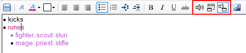

# ACT Notes Plugin
This Advanced Combat Tracker (ACT) plugin provides a means of organizing notes about zones and mobs.

The left hand panel provides a list of zones with subheadings for mobs within that zone.

The right hand panel provides a basic editor for any notes about the selected zone or mob.

All entries are user-generated, but can be shared using ACT's XML sharing mechanism.

An example is shown below.

## Version Notes
_Version 1.4.0_
* Added another folder level to help organize notes.
* Added an option to advance to the next note at [combat end](#monitoring) regardless of the outcome of the fight (to workaround EQII death reporting inconsistencies). This changes [alert](#alerts) behaviour for a failed fight. Default is enabled.
* Added [very simplistic numbered lists](#adding-notes).
* Added a way to add a mob name to the list using [EQII in game commands](#adding-from-eq2-game-chat).
* Added `Import RTF` context menu choice.
* Fix to activate an alert even if is is the very last thing in a note.
* Fix alert window auto-sizing.
* Changed the encounter name delimiter from comma to semicolon to accomodate individual mob names that contain commas, like `Sleujess, Pride Guardian`.

## Adding Tree Folders
The **[Add Group]** button creates a new top level "zone group" folder. 
The **[Add Zone]** button creates a new entry in the selected group's zone list. 
The **[Add Mob]** button creates a new mob in the currently selected zone.

When plugin version 1.4 is first run, all existing zones are placed in the ` Default Group` folder. (Notice the leading space so this group sorts at the top.)

Zones can be drag-and-dropped between group folders.

Zone and mob names can be arbitrary text, but if they match in-game zone and mob names, the plugin will track when you enter the zone or fight the mob.

For EQII zones with a color code and/or instance number, the plugin can match the zone name with a category that does not include the color code or the instance number. So if you don't want a category like __\\#00FF00Buried Takish'Hiz: Empire of Antiquity [Contested] 2__, a category name of __Buried Takish'Hiz: Empire of Antiquity [Contested]__ will still match when entering that zone.

### Adding From Encounters
The encounter list on ACT's main tab can be used to add zone and mob folders.
The default text when adding a new zone or mob is the selected zone name or mob name in the main encounter list.

In the example below, the desired zone is selected, then in the selected group in the Note plugin, press the **[Add Zone]** button, then the `Enter` key
is pressed to accept the entry. Mobs are similarly added by selecting the mob, pressing the **[Add Mob]** button, 
then the `Enter` key. Mob names can be picked up from either the zone encounter list or a particular mob encounter list. Both sources of a mob name are shown in the example below.

When a fight involves more than one name, if all the names are entered for the mob name (separated by semicolons), the plugin will try to match each name when monitoring kills. In the example below, two-mob fights are set up with minimal typing by using the following steps:
  1. On the ACT Main tab, select the first mob
   2. On the plugin tab, press **[Add Mob]** and `<Enter>`
   3. On the Main tab, select the second mob in the first mob's encounter list
   4. On the plugin tab, press **[Add Mob]**, then answer "Yes" to the append question

### Adding From EQ2 Game Chat
A mob can be added with commands in EQ2 chat. When the following two commands are issued in sequence, the plugin adds (if not already present) the current zone and targeted mob to the currently selected group (or ` Default Group` if no group is selected):  
>`/note add`  
>`/con`  

The `/note add` command will generate an `Unknown command` error in EQ2, which is okay, the plugin still recognizes it.

## Adding Notes
Simply type in the editor panel after a zone or mob is selected to create a note for that zone or mob.

The editor allows the choice of font, colors, bullets, numbered lists, URLs, images, etc.

The numbered list is currently rather quirky. When the indent or outdent button is pushed it automatically selects predefined outline number formats for each indent level. It will cycle through 5 different formats. The sequence number and format are only caluculated in response to pressing the indent or outdent button. Any indenting works best when selecting a single paragraph and pressing the appropriate button. Changing the indent of a paragraph in the middle of a list will most likely require re-indent/outdent of following paragraphs, one at a time, to recalculate their sequence numbers.

The editor can save many image types using either `Ctrl-V` to insert from the clipboard, or the `Insert image from file` toolbar button (which also uses the clipboard).
**Note:** The plugin saves the images as text bitmaps, which is not efficient for loading, storing, or sharing (i.e. even a small image results in a lot of share blocks).

## Monitoring
Whenever a player enters a zone, the plugin searches its zone list for a matching zone name.
If a match (stripping the color code and instance number if required) is found, that zone is selected. 

If the zone itself has a note that contains any alerts, that note is displayed.

If there are no alerts for the zone, but there are mobs, the first mob in the zone's list is selected, whether the mob has a note or not.

When an encounter ends, the plugin looks for the enemy's name in its mob list for the zone. 
If the just-ended encounter's name is found, the next mob in the zone list is automatically selected. 
The intent is to display the note and alert for the mob you are about to engage. 

If the `Skip Kill Check` option is disabled, the plugin only selects the note for the next mob if the combat was successful, i.e. ACT marks the encounter green.

If the `Skip Kill Check` option is enabled, the plugin selects the next note regardless of combat success, i.e. whether ACT marks the encounter green, orange, or red. This is to work around EQII inconsistencies in reporting the death of a mob.

The `Skip Kill Check` setting is accessed via right-clicking the zone name, is saved for each individual zone, and is enabled by default.

If the mob order in the zone list is not in the order you usually kill them, 
the list can be re-ordered by draggging and dropping the mobs into the desired order.

### Alerts
When the plugin automatically selects the next mob upon zone-in or after recognizing the end of combat for a mob, the plugin scans the selected note for color-coded alert tags. (If the user selects the note by clicking in ACT, alert tags do not generate alerts.)

The plugin can generate both audio and visual alerts. 

The alerts are delalyed after the note is selected. The delays are individually set for each mob or zone in a dialog accessed by right-clicking the mob or zone name. There is a separate delay for audio and visual alerts. They both default to 5 seconds.

If the `Skip Kill Check` option is enabled, the next mob's alerts will be generated even if a fight ends unsuccessfully. For example, in the screenshot above, if `Isos` has an alert and the `Nezri En'Sallef` fight fails, the `Isos` alert still activates after the `Nezri En'Sallef` fight ends. The alert will activate on each end-of-combat for the `Nezri En'Sallef` fight.

If `Skip Kill Check` is unchecked, the fight must end successfully before the next mob is automatically selected. In EQ2, successful fights are frequently not flagged as successful due to "missing" log lines.

The plugin uses the color of the text to generate alerts. Three different predefined colors tag audio, visual, and audio-visual alerts. The text color is set using the editor toolbar. Select the text for the alert and press the audio, visual, or audio-visual toolbar button to toggle the color of the selected text. The buttons are outlined in red in the example below. When the cursor is within an alert tag, the appropriate button is "pressed". In the example below, the cursor is in the `runes` alert so the audio-visual alert button is "pressed".

The example below has a mix of audio-visual, and visual alerts. To keep the audio announcement short, only "runes" is tagged as an audio-visual alert. But to provide all the desired information, the notes about which rune for which class are tagged as visual alerts.

If the note contains several alert tags, they all occur in the same audio alert and on separate lines in the popup alert. The audio will contain a pause between individual  alerts.

For example, for the note above with audio and visual alerts, five seconds after the note is automatically selected, the plugin will announce "Khosrow Al'Vaz, runes" and show the popup

The plugin recognizes alert tags using just the three predefined colors. Other text attributes like font or bold do not affect the tag.

The plugin only searches the first section if there are un-accepted [replacement notes](#previous-note-replacement).

## Sharing Notes
The `Copy to XML` menus allow sharing notes in ACT with other users of the plugin. The `Export RTF` menu allows exporting the notes out of ACT to a WordPad/MSWord file. The `Import RTF` imports an RTF file into the note for the selected folder.

Right-click the group name in the tree to share a group. Right-click the zone name in the tree to share a zone. Right-click a mob name in the tree to share a mob.

The right-click menu offers a `Copy to XML` choice which only copies the selected item. For the group level, a note can only be shared if the player receiving the note already has a group with that same name.

The right-click menu for groups and zones offers a `Copy Entire Group to XML` or `Copy Entire Zone to XML`.  These add the selected item and all child items' notes to the dialog's share list. The received notes may get scrambled if the player(s) receiving multiple notes from these commands are not running plugin version 1.3 or newer, or if the sending player is not whitelisted by the receiver. If one or the other of those is not true, the best chance of success is for the receiver to accept the data from ACT's *Options, Configuration Import/Export, XML Share Snippets* yellow window in the order in the window from top to bottom.

The notes are stored as Rich Text Format (RTF). This format provides the capability to change the font, color, bullets, etc, but adds overhead.

Wordpad and Microsoft Word can also handle RTF files. To create an RTF file from ACT Notes, right-click a folder in the left-hand panel and choose `Export to RTF...`. The selected folder and all of its children (if any) will be exported.

### Share Channel
For the first XML share in a zone, the plugin guesses whether you are likely in a group or raid from the selected zone name
and chooses the supposed prefix, `/g` or `/r`. This can be changed by selecting the appropriate button.
To paste in a different channel, use the `custom` choice. For example, if you wanted to paste to the guild, you would select the `custom` button and enter `/gu` in the textbox. The selected prefix is saved for each group and zone.

### Note Segmenting
EQII can only paste around 250 characters at a time in a chat window, and allows about 1000 characters per line and 16 lines in a macro. Even a small shared note requires multiple sections.

The plugin automatically breaks a note into appropriate sharable sizes.

There are two methods for sharing a note. The first method is similar to how a trigger is shared in ACT. The second method uses EQII macros.

The plugin searches for an EQII game window when it opens the share dialog. If a game window is found, the dialog shows the macro command list by default. The clipboard copy list can be shown by pressing the __[Copy]__ button.

 Notes with even a small image in them will result in a lot of sections, making the macro the only reasonable option. Version 1.1 of the plugin adds an option to compress notes with images. This typically reduces the number of sections. But the recipient of the note must be running plugin version 1.1 or newer to decode the compression. **Version 1.0 of the plugin will generate an error every time it tries to view the note if it receives a compressed note.**

Once all recipients have updated to plugin version 1.1 or newer, the **Compress Images** checkbox can remain checked. The checkbox has no effect if the note does not contain an image since there is not a big difference between the size of a compressed and uncompressed note that does not contain any image.

Below is an example that results in one macro when compressed. This particular note is 200 copy sections or three macros when not compressed.

#### Method 1: Paste Share
To paste into a chat window, the sender of the note needs to copy each section from the plugin using the plugin's **[Copy]** button and then use `Ctrl-V` to paste it in the chat window. In the example below, three sections are required. The `/g` selection prefixes the section with the groupsay command. 

When the **Game Window:** is not blank, pressing the **[Macro]** or **[Copy]** button activates the selected game window. Once the game window is activated, the chat box can be activated by pressing the `Enter` key. (`Enter` is the default key binding. Use whatever key is set in _Options->Controls->Chat Keys->Begin Chat_.) The user can then press `Ctrl-v` to paste and `Enter` to complete the command.

In the example below, since a game window was found, the initial list contains the macro commands. Pressing the **[Copy]** button switches the list to the section list. The user then follows the procedure below:
1. Verify or select the appropriate prefix and image compression
2. Press the **[Copy]** button (or `Alt-c`) to put the selected section in the clipboard and activate the game window.
3. Press `Enter` to activate the game chat window
4. Press `Ctrl-V` to paste the section.
4. Press `Enter` again to finish the paste.
5. Repeat from Step 2. (`Alt-Tab` should return focus to the dialog.) The plugin automatically moves to the next section when the **[Copy]** button (or `Alt-c`) is pressed.
6. Repeat until all sections are pasted into game chat.
7. Press **[Done]** to dismiss the dialog.

This process is illustrated below.

#### Method 2: Macro Share
The plugin's **[Macro]** button generally takes fewer steps to share a note. Pressing the **[Macro]** button generates enough text files to share the note. The text file names follow the format `note-macroX.txt` where `X` is a number starting with 1 and incrementing until enough files are created to share the entire note, e.g. the first 16,000 or so characters would be shared using the macro file `note-macro1.txt`.

When the plugin finds an EQII game window, the share dialog initially opens with the list of macro commands.

To share using macros, the user follows the procedure below:
1. Verify or select the appropriate prefix and image compression.
2. Press the **[Macro]** button (or `Alt-m`) to put the selected command in the clipboard and activate the game window.
3. Press `Enter` to activate the game chat window.
4. Press `Ctrl-v` to paste the command.
5. Press `Enter` to finish the paste.
5. Continue from Step 2. (`Alt-Tab` should return focus to the dialog.) The plugin automatically moves to the next line when the **[Macro]** button (or `Alt-m`) is pressed.
6. Repeat until all commands are pasted into game chat.
6. press **[Done]** to dismiss the dialog.

This process is illustrated below for a note with compressed images.

#### Section Reception
The receiver of the note needs to accept each section. A single macro can contain up to 16 sections.

If lots of sections arrive faster than the receiver can click the ACT `Add Now` button for XML shares,
they may still be accepted on ACT's `Options` tab, `Configuration Import/Export` heading,
`XML Share Snippets` section. But sections must be accepted in the order they are received. Select each one listed in the yellow box and press the **[Import Above Data]** under the white box. **Note:** the `Add Now` button can be bypassed for trusted players by adding them to the `Automatically accept data from` in the green list.

### Previous Note Replacement
If the receiving player does not have an existing note for the incoming zone or mob, 
the plugin creates the appropriate entities.

If the receiving player does not already have the incoming zone, or if the receiving player has the incoming zone but it is in the ` Default Group`, the zone is placed in the incoming group. If the receiving player already has the incoming zone in a different group from the incoming group, the zone remains in its original group. This is so the incoming share does not rearrange the receiving player's groupings.

The plugin provides several options at the bottom of the edit pane for receiving shared notes when the receiving player already has a note for that zone or mob.

* **Append**: The incoming note will be appended to the existing note if the notes are different.
* **Replace**: The incoming note will replace the existing note.
* **Ask**: The plugin will prompt for whether to append, replace, or ignore the incoming note.
* **Accept**: The incoming note will replace the existing note if the sender is on the receiver's whitelist.
  * The note is appended if the sender is not whitelisted.
  * This option is not present if the user's whitelist is empty.

This setting is saved for each group and zone.

### Compare Preexisting and Received Notes
When an incoming note is appended to an existing note, a delimiter line is added between the old note and the new one and the **[Compare]** button becomes active. Pressing the **[Compare]** button opens a new window showing the difference between the text above the first delimiter and the text below the first delimiter. If there are multiple append delimiters, the comparison is only between the first two parts.

The comparison shows the ***text*** differences at the line level. Formatting is ignored. Multiple spaces are ignored. Character case is ignored. 

Lines that are different are shown in yellow. Grey lines are used to keep the unchanged lines aligned - this works best if the difference window is wide enough to hold an entire note line on one screen line.

The **[Replace]** button overwrites the original note with the (first) received note. The delimiter line determines note boundaries. If there is more than one received note, the second and subsequent remain in the resulting note.

The **[Discard]** button removes the received note from the editor. The delimiter line determines note boundaries. If there is more than one received note, the second and subsequent remain in the resulting note.

An example is shown below:

